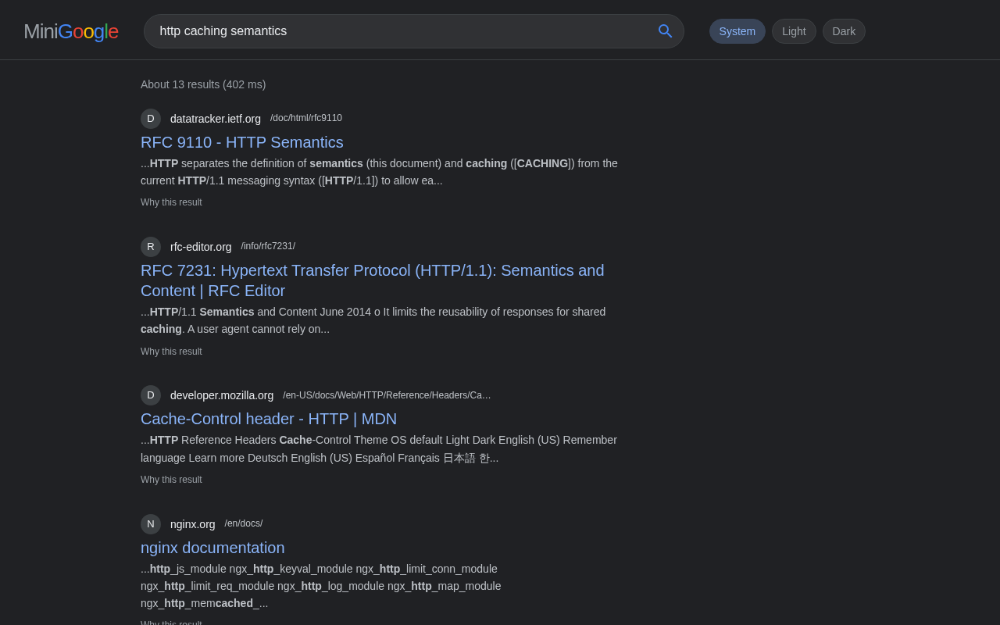
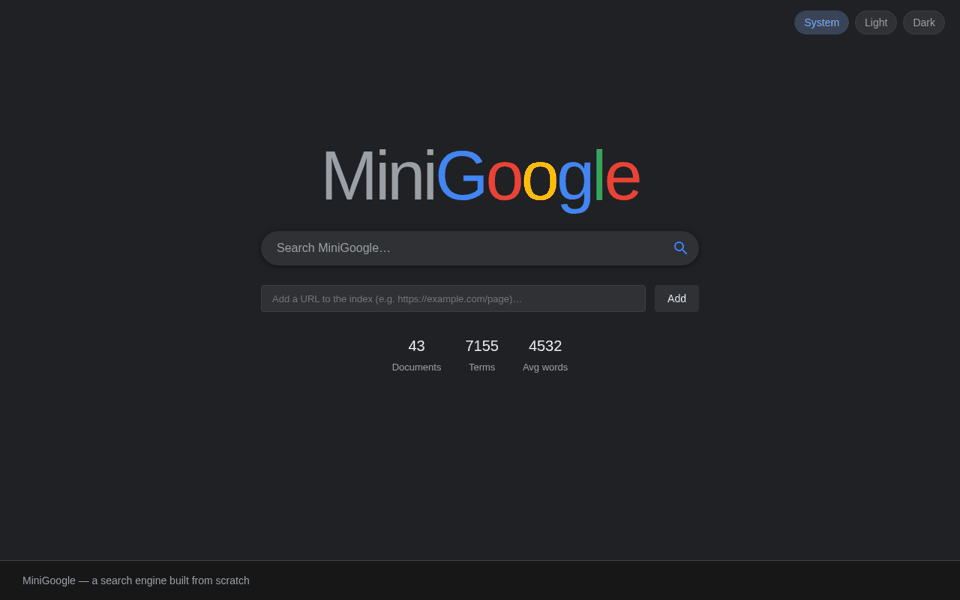

# MiniGoogle

A search engine you run yourself: crawl pages into it, query them over HTTP or in the bundled web UI, and, if you need it, run several nodes that place documents by consistent hashing, track each other by gossip and replicate a key-value store by Raft. Java 21, one jar, one Docker image.

[](https://github.com/Yasser-Ameur/minigoogle/actions/workflows/ci.yml)
[](LICENSE)

<picture>
  <source media="(prefers-color-scheme: dark)" srcset="assets/hero-dark.png">
  <source media="(prefers-color-scheme: light)" srcset="assets/hero-light.png">
  
</picture>

## Try it

```bash
docker volume create minigoogle-data
docker run -d --name minigoogle -p 8080:8080 \
  -v minigoogle-data:/data \
  -e MINIGOGLE_API_KEY=change-me-please-16plus \
  ghcr.io/yasser-ameur/minigoogle:latest
curl localhost:8080/api/v1/health/ready
```

```
{"status":"ok","version":"1.0.0","uptimeSeconds":8,"checks":{"index":{"status":"ok","documents":20}}}
```

Open [http://localhost:8080](http://localhost:8080). The node starts with 20 built-in demo documents (all at `example.com/...`), so the first useful step is to add real pages. The key protects that route:

```bash
curl -X POST localhost:8080/api/v1/crawl \
  -H "Content-Type: application/json" \
  -H "X-API-Key: change-me-please-16plus" \
  -d '{"url": "https://raft.github.io/"}'
```

```
{"success":true,"title":"Raft Consensus Algorithm","url":"https://raft.github.io/"}
```

Then search:

```bash
curl -X POST localhost:8080/api/v1/search \
  -H "Content-Type: application/json" \
  -d '{"query": "raft leader election", "pageSize": 1}'
```

```
{"executionTimeMs":0,"totalResults":9,"results":[{"url":"https://raft.github.io/","title":"Raft Consensus Algorithm","snippet":"...**Lead**er **Election** + Log Replication? Persistence? Membership Changes? Log Compaction? Published with GitHub Pages. View on GitHub. This work is licensed...","score":0.5612902275514308,"bm25Score":11.515339525128649,"pageRankScore":0.006396588486141068}],"maxPageRank":0.0,"maxDocLength":0.0,"page":1,"pageSize":1}
```

That output is from a node holding 43 pages, so your `totalResults` and scores will differ. Anything you add lands in the `/data` volume and is still there after `docker restart minigoogle`. To remove everything:

```bash
docker rm -f minigoogle
docker volume rm minigoogle-data
```



The walkthrough above, one still per step: the home page with the index count; a URL pasted into the add box, which the server refuses until a key is entered; the same URL accepted, with the count going up; suggestions appearing while typing; the results page; the first result's "Why this result" panel showing its BM25, PageRank and combined scores. The pages in the frame were crawled with [`assets/seed.sh`](assets/seed.sh); the stills come from [`assets/capture.cjs`](assets/capture.cjs) and the GIF from [`assets/make-gif.py`](assets/make-gif.py).

## Contents

- [What the demo opened](#what-the-demo-opened)
- [How it works](#how-it-works)
- [HTTP API](#http-api)
- [Configuration](#configuration)
- [Authentication](#authentication)
- [Persistence](#persistence)
- [Observability](#observability)
- [Running a cluster](#running-a-cluster)
- [Kubernetes](#kubernetes)
- [Running from source](#running-from-source)
- [Tests and benchmarks](#tests-and-benchmarks)
- [Relevance](#relevance)
- [Image and CI](#image-and-ci)
- [Reproducing the screenshots](#reproducing-the-screenshots)
- [Further reading](#further-reading)
- [License](#license)

## What the demo opened

The page at `/` is a React 18 single-file build served by the Java process (`src/main/resources/demo/index.html`). It has a search box with suggestions from `/api/v1/suggest`, a results list where every hit can expand a "Why this result" panel with its BM25, PageRank and combined score, an "Add a URL to the index" box that asks for the API key on a 401 and remembers it, and a System / Light / Dark theme switch. The layout and colours are google.com's own: Arial, a white or `#202124` ground, blue titles, grey snippets, a pill search box, and the four brand colours only in the wordmark (`frontend/src/styles.css`). The hero above is the same page in dark and light.

## How it works

A `STANDALONE` node (the default) does everything in one JVM:

1. At start it indexes the 20 built-in demo documents plus every document ever submitted through `POST /api/v1/crawl`, replayed from `crawled-documents.jsonl` under the index directory.
2. `POST /api/v1/crawl` fetches one URL, parses it with jsoup, appends it to that file and rebuilds the index. A target that cannot be fetched comes back as `502 FETCH_FAILED` (Wikipedia, for instance, answers the crawler with 403).
3. `POST /api/v1/search` scores by BM25 and PageRank, and, with `semantic.enabled` on as it is by default, merges lexical and semantic candidates before ranking (asserted by `HybridEndToEndTest` and `SemanticEndToEndTest`). Pure BM25 is what the Relevance section below measures.

Runtime dependencies are jsoup, Jackson, Gson, ONNX Runtime and SLF4J with Logback (`build.gradle.kts`). The HTTP server is `com.sun.net.httpserver` wrapped in `RestServer`; there is no web framework.

## HTTP API

Full request and response shapes and every status code per route: [`API.md`](API.md) and [`docs/openapi.yaml`](docs/openapi.yaml). A `STANDALONE`, `SEARCH` or `CLUSTER` node registers:

| Method | Path | Notes |
|---|---|---|
| GET | `/` | Web UI |
| GET | `/api/v1/health` | Liveness, with the version and the document count |
| GET | `/api/v1/health/ready` | Readiness; the probe the Docker image and the compose file call |
| GET | `/api/v1/version` | `{"version":"1.0.0"}` |
| GET | `/metrics` | Prometheus text format 0.0.4; protected when a key is set |
| POST | `/api/v1/search` | `{"query": "...", "page": 1, "pageSize": 10}` |
| GET | `/api/v1/suggest?q=` | Autocomplete, a JSON array of strings |
| GET | `/api/v1/stats` | `documentCount`, `vocabularySize`, `averageDocumentLength` |
| GET | `/api/v1/analytics` | Query statistics |
| POST | `/api/v1/click` | Click feedback for the learning-to-rank model |
| GET | `/api/v1/ml/stats` | Ranking model features and weights |
| GET | `/api/v1/entities?q=` | Knowledge graph lookup |
| POST | `/api/v1/crawl` | Protected; adds one URL |
| GET | `/api/v1/cluster/status` | `CLUSTER` node only |
| POST | `/api/v1/cluster/kv` | `CLUSTER` node only. A `GET` handler is registered in the source, but the route answered `405` in this session's run |

A `COORDINATOR` node keeps no local index and serves `GET /api/v1/cluster/state` instead of the two cluster routes; `API.md` lists the rest of the difference.

### Search

`POST /api/v1/search` takes `query`, and optionally `page` (from 1) and `pageSize`. With `{"query": "http caching semantics", "page": 2, "pageSize": 5}` against a 13-hit query the node returned `page` 2, `pageSize` 5 and five results. Each result has `url`, `title`, `snippet` (matched terms wrapped in `**`), `score`, `bm25Score` and `pageRankScore`; the envelope has `executionTimeMs`, `totalResults`, `page` and `pageSize`. The UI shows exactly these numbers in its "Why this result" panel.

### Suggest, stats, analytics, click, ml, entities

```bash
curl 'localhost:8080/api/v1/suggest?q=cach'
```

```
["cache","caching","cached","caches","cacheable","cache control","cacheable i","cache controls"]
```

```bash
curl localhost:8080/api/v1/stats
```

```
{"documentCount":43,"vocabularySize":7186,"averageDocumentLength":4585,"version":"1.0"}
```

`GET /api/v1/analytics` returns `totalQueries`, `averageLatencyMs`, `zeroResultRate`, `uniqueQueryCount` and `topQueries` (query and count). It is not protected, so on a shared instance it shows other people's queries.

`POST /api/v1/click` with `{"query","url","position"}` records a click for the learning-to-rank model and answers `{"success":true,"documentId":23,"position":1,"trainedPairs":0}`; `GET /api/v1/ml/stats` lists the eight features the model weighs (`BM25`, `PAGE_RANK`, `TITLE_MATCH`, `URL_MATCH`, `TERM_OVERLAP`, `SEMANTIC_SIMILARITY`, `DOC_LENGTH`, `POSITION`), their current weights, and the click and impression counts.

`GET /api/v1/entities?q=raft` returns the entities extracted from the corpus that match, each with a `count` and its `related` entities with scores.

### Errors

Every response carries an `X-Request-Id` header; a valid id sent by the client is echoed back. Errors share one shape:

```bash
curl localhost:8080/api/v1/nothing
```

```
{"error":{"code":"NOT_FOUND","message":"No such route"},"requestId":"f2148245-7745-4a51-982c-a3b9633450fa"}
```

| Status | Code | When |
|---|---|---|
| 400 | `BAD_REQUEST` | Malformed JSON body |
| 401 | `UNAUTHORIZED` | Protected route without a valid key |
| 404 | `NOT_FOUND` | No such route |
| 405 | `METHOD_NOT_ALLOWED` | Wrong method for the route |
| 413 | `PAYLOAD_TOO_LARGE` | POST body over `server.maxBodyBytes` |
| 429 | `RATE_LIMITED` | Only when a rate limit is configured; carries `Retry-After` |
| 502 | `FETCH_FAILED` | `POST /api/v1/crawl` could not fetch the URL |
| 503 | `SERVICE_BUSY` | The bounded request queue is full; carries `Retry-After: 1` |
| 504 | `TIMEOUT` | A handler exceeded `server.requestTimeoutMs` |
| 500 | `INTERNAL` | Unhandled error; the exception message is not returned |

Bodies of 1024 bytes or more are gzipped only when the client sends `Accept-Encoding: gzip`. On shutdown the server stops accepting and waits for in-flight handlers up to `server.shutdownGraceMs`.

## Configuration

Precedence is environment variable, then `config/application.yaml`, then the built-in default. Every variable below maps to one yaml key in `ConfigurationLoader`; `.env.example` repeats the list with comments. The unprefixed names some orchestrators set (`NODE_TYPE`, `NODE_PORT`, `NODE_ID`, `CLUSTER_PEERS`, `CLUSTER_PORT`, `CLUSTER_SECRET`, `ADVERTISED_HOST`, `INDEX_DIR`) are read too; `docker-compose.yml` uses them.

| Env var | yaml key | Default | Meaning |
|---|---|---|---|
| `MINIGOGLE_API_KEY` | `security.apiKey` | (empty, open) | Key for protected routes; 16 characters minimum or startup fails |
| `MINIGOGLE_NODE_TYPE` | `node.type` | `STANDALONE` | `STANDALONE`, `SEARCH`, `COORDINATOR` or `CLUSTER` |
| `MINIGOGLE_NODE_PORT` | `server.port` | `8080` | REST API port |
| `MINIGOGLE_NODE_HOST` | `server.host` | `0.0.0.0` | REST API bind address |
| `MINIGOGLE_INDEX_DIR` | `indexing.indexDir` | `demo-index` (`/data/index` in the image) | Index directory; crawled documents are stored under it |
| `MINIGOGLE_NODE_ID` | `cluster.nodeId` | (unset) | Stable id of this cluster member |
| `MINIGOGLE_CLUSTER_PEERS` | `cluster.peers` | (unset) | `nodeId=http://host:port` pairs, comma separated |
| `MINIGOGLE_CLUSTER_PORT` | `cluster.port` | `8081` | Internal RPC port |
| `MINIGOGLE_CLUSTER_COORDINATOR_URL` | `cluster.coordinatorUrl` | (unset) | Where a `SEARCH` node registers |
| `MINIGOGLE_REPLICATION_FACTOR` | `cluster.replicationFactor` | `3` | Ring owners each crawled document is placed on in a `CLUSTER` (clamped to the member count) |
| `MINIGOGLE_GOSSIP_DEAD_TIMEOUT_MS` | `cluster.gossipDeadTimeoutMs` | `90000` | Silence after which a `SUSPECT` peer is declared `DEAD` and leaves the ring; `cluster.nodeTimeout` (30000, yaml only) is the `SUSPECT` threshold |
| `MINIGOGLE_CLUSTER_SECRET` | `cluster.secret` | (unset) | Shared secret peers must present to each other |
| `MINIGOGLE_ADVERTISED_HOST` | `cluster.advertisedHost` | `localhost` | Hostname this node advertises to peers |
| `MINIGOGLE_LOG_LEVEL` | `logging.level` | `INFO` | Root logger level |
| `MINIGOGLE_MAX_THREADS` | `server.maxThreads` | `64` | Request handler pool size |
| `MINIGOGLE_MAX_BODY_BYTES` | `server.maxBodyBytes` | `1048576` | POST bodies above this get 413 |
| `MINIGOGLE_REQUEST_TIMEOUT_MS` | `server.requestTimeoutMs` | `10000` | Handlers slower than this answer 504 |
| `MINIGOGLE_SHUTDOWN_GRACE_MS` | `server.shutdownGraceMs` | `10000` | How long shutdown waits for in-flight requests |
| `MINIGOGLE_RATE_LIMIT_PER_SECOND` | `server.rateLimit.perSecond` | `0` | Per-client token bucket; `0` disables |
| `MINIGOGLE_RATE_LIMIT_BURST` | `server.rateLimit.burst` | `0` | Bucket size; `0` means ceil(perSecond) |
| `MINIGOGLE_CORS_ORIGINS` | `server.cors.origins` | (empty) | `*`, or a comma list of origins; empty sends no CORS headers |

### Rate limit and CORS

The rate limit is a token bucket per client address. Once it trips, the second request answers `429` with a `Retry-After` header. Idle buckets are swept: 20,000 distinct addresses do not leave 20,000 buckets behind.

CORS has three modes. `*` puts `Access-Control-Allow-Origin: *` on every response whatever the `Origin`. A comma list echoes a matching `Origin` back with `Vary: Origin` and answers a preflight from a non-matching origin with `403 FORBIDDEN_ORIGIN`. Empty sends no CORS header at all.

### Keys with no environment variable

The rest of `config/application.yaml` is file-only. These are the shipped values:

```yaml
search:
  topK: 20
  maxResults: 100
  timeoutMs: 5000

semantic:
  enabled: true            # build the content-based vector index and rerank by cosine
  dimension: 128           # embedding dimensionality (feature hashing bucket count)
  weight: 0.3              # blend weight: 0 = pure lexical, 1 = pure semantic
  expansion:
    enabled: true          # corpus-derived PMI query expansion
    windowSize: 10
    pmiThreshold: 1.0
    maxNeighbors: 5
  hybrid:
    enabled: true          # merge lexical and vector recall at search time
    lexicalWeight: 0.5
    fetchK: 60
  knowledge:
    enabled: true          # build the corpus knowledge graph
    maxEntitiesPerDoc: 10
    maxRelated: 8

ml:
  ltr:
    enabled: true           # re-rank search results with the learned model
    epochs: 3
    learningRate: 0.05
  click:
    enabled: true           # record clicks and feed them back into the model
    trainAfterClicks: 25
```

`crawler` (`workers`, `maxDepth`, `politenessDelay`), `indexing` (`segmentSize`, `compactionThreshold`) and `logging.format` sit in the same file. The Docker image copies `config/` next to the jar in `/app`, and the process reads `config/application.yaml` relative to that directory, so `/app/config/application.yaml` is the file to replace.

## Authentication

`POST /api/v1/crawl` and `GET /metrics` are protected when `MINIGOGLE_API_KEY` (or `security.apiKey`) is set. Either header works:

```
X-API-Key: <key>
Authorization: Bearer <key>
```

A key shorter than 16 characters stops the process at startup; exactly 16 is accepted. Leave the key blank and both routes are open, which is fine on a laptop and wrong on anything reachable from a network. Prometheus needs one of the headers above in its scrape config once a key is set. The web UI keeps the key you type in `localStorage` under `minigoogle-api-key` and sends it as `X-API-Key` with each add request.

Without the key the protected routes answer:

```
{"error":{"code":"UNAUTHORIZED","message":"Missing or invalid API key"},"requestId":"3d60a543-305e-4705-be06-7eb7e6c76ed7"}
```

## Persistence

Documents submitted through `POST /api/v1/crawl` are appended to `crawled-documents.jsonl` under the index directory, one JSON object per line, and replayed when the process starts. A torn final line (the process died mid-append) is skipped with a warning rather than failing the boot. Submitting a URL that is already stored replaces the stored line, though the running index counts the page twice until the next start (43 documents became 44, then 43 again after a restart). In the Docker image the index directory is `/data/index` on the `/data` volume, which is why the try-it command mounts one; the demo node above kept its 43 documents across `docker restart`.

## Observability

`GET /metrics` with the key returns Prometheus text format 0.0.4:

| Metric | Type |
|---|---|
| `minigoogle_build_info{version}` | gauge |
| `process_uptime_seconds` | gauge |
| `jvm_memory_used_bytes{area}` | gauge |
| `jvm_threads_current` | gauge |
| `minigoogle_http_requests_total{method,route,status}` | counter |
| `minigoogle_http_request_duration_seconds{method,route}` | histogram |
| `minigoogle_search_duration_seconds` | histogram |
| `minigoogle_search_queries_total` | counter |
| `minigoogle_search_zero_result_queries_total` | counter |
| `minigoogle_index_documents` | gauge |

Two sample lines from a scrape:

```
minigoogle_build_info{version="1.0.0"} 1
minigoogle_http_requests_total{method="POST",route="/api/v1/crawl",status="401"} 1
```

`/api/v1/health` and `/api/v1/health/ready` both answer `200` with the version, uptime and document count on a running node. `/api/v1/health/ready` is the one the image's `HEALTHCHECK` and the compose `healthcheck` call, so point a load balancer or a Kubernetes readiness probe at it as well. Requests are logged one line each, `POST /api/v1/crawl -> 502 (145 ms) requestId=...`, at `INFO`.

## Running a cluster

A `CLUSTER` node runs three things beside its own index and REST API: gossip membership, a consistent hash ring built from that membership, and Raft for the replicated key-value store. Membership decides who is alive, the ring decides which nodes hold each crawled document, and Raft never reads either once its configuration is committed.

`docker-compose.yml` starts three such nodes, each with its own `/data` volume, sharing `MINIGOGLE_CLUSTER_SECRET` and the crawl key `change-me-please-16plus`, with the public API on 8080, 8081 and 8082 and the internal RPC port on 9080 to 9082:

```bash
git clone https://github.com/Yasser-Ameur/minigoogle.git && cd minigoogle
docker compose up --build -d
curl localhost:8080/api/v1/cluster/status
```

```
{"nodeId":"minigoogle-1","state":"FOLLOWER","term":1,"leader":"minigoogle-3","commitIndex":0,"members":["minigoogle-1","minigoogle-2","minigoogle-3"],"liveNodes":["minigoogle-1","minigoogle-2","minigoogle-3"]}
```

Crawl on one node and the ring places the document on `cluster.replicationFactor` owners (3 by default, so on three nodes every document lands everywhere). The response names them:

```bash
curl -X POST localhost:8080/api/v1/crawl -H "Content-Type: application/json" \
  -H "X-API-Key: change-me-please-16plus" -d '{"url":"https://raft.github.io/"}'
curl -X POST localhost:8082/api/v1/search -H "Content-Type: application/json" -d '{"query":"raft consensus"}'
```

```
{"success":true,"title":"Raft Consensus Algorithm","url":"https://raft.github.io/","owners":["minigoogle-3","minigoogle-2","minigoogle-1"],"replicatedTo":["minigoogle-3","minigoogle-2"]}
```

Every node's `/api/v1/stats` then reports 21 documents, and the search on node 3 returns `https://raft.github.io/` second. `POST /api/v1/search` on a `CLUSTER` node fans out to every live member, merges, deduplicates by URL and ranks once; if the fan-out fails it answers from its own index.

Stop a node and watch membership follow it. After `cluster.nodeTimeout` (30 s) of silence the peer is `SUSPECT` and leaves `liveNodes`; after `cluster.gossipDeadTimeoutMs` (90 s) it is `DEAD` and leaves the ring, so a document crawled then gets two owners instead of three:

```bash
docker compose stop minigoogle-3
sleep 40 && curl localhost:8080/api/v1/cluster/status
sleep 65 && curl -X POST localhost:8080/api/v1/crawl -H "Content-Type: application/json" \
  -H "X-API-Key: change-me-please-16plus" -d '{"url":"https://www.postgresql.org/docs/current/mvcc-intro.html"}'
```

```
{"nodeId":"minigoogle-1","state":"LEADER","term":2,"leader":"minigoogle-1","commitIndex":0,"members":["minigoogle-1","minigoogle-2","minigoogle-3"],"liveNodes":["minigoogle-1","minigoogle-2"]}
{"success":true,"title":"PostgreSQL: Documentation: 18: 13.1. Introduction","url":"https://www.postgresql.org/docs/current/mvcc-intro.html","owners":["minigoogle-2","minigoogle-1"],"replicatedTo":["minigoogle-2"]}
```

Start it again and it rejoins within a gossip round. The join triggers a repair on every node: each re-offers the documents it owns to their other owners, ingest is a no-op for a URL already held, and 45 s after `docker compose start minigoogle-3` all three nodes report 23 documents and node 3 answers a search for `mvcc` with the page crawled while it was dead. Nothing is ever deleted by repair; a node that stops owning a key range keeps its copies, and search deduplicates them.

Two boundaries. Repair runs on membership change, so a node restarted inside `cluster.nodeTimeout` never left and keeps whatever it missed until the next join or leave. And a document crawled while a node is `SUSPECT` (still in the ring, unreachable) reaches only the owners that answer, as `replicatedTo` shows.

The key-value store is what Raft replicates. Write a key through the leader, then stop it:

```bash
curl -X POST localhost:8080/api/v1/cluster/kv -d '{"key":"k","value":"v"}'
docker compose stop minigoogle-1
sleep 12
curl localhost:8082/api/v1/cluster/status
```

A survivor is leader in the next term with the write committed; `DeployedClusterIntegrationTest.threeNodeClusterElectsReplicatesSurvivesLeaderLossAndRecovers` asserts the scenario end to end. Reading the key back over `GET /api/v1/cluster/kv?key=k` answered `405 METHOD_NOT_ALLOWED` on every node when this page was written, although `MiniGoogleApp.java` registers a `GET` handler on that path beside the `POST` one, so the read example in the compose file's comments does not work yet. `docker compose down -v` removes the three volumes.

## Kubernetes

`k8s/` holds manifests for a coordinator, search-node and crawler split (`deployment-*.yaml`, `service-*.yaml`, `hpa-search-node.yaml`), a `CLUSTER` `statefulset-cluster.yaml`, plus `configmap.yaml`, `ingress.yaml`, `namespace.yaml` and `network-policy.yaml`. They were not applied while writing this page; treat them as a starting point and check the probes and image tag against your cluster.

## Running from source

Needs JDK 21 and, for the UI, Node 20. The Gradle wrapper is 8.7. Without Node the `frontendBuild` task is skipped and the checked-in `src/main/resources/demo/index.html` is served, which is how the Docker image is built.

```bash
git clone https://github.com/Yasser-Ameur/minigoogle.git
cd minigoogle
./gradlew build -x test
java -jar build/libs/mini-google.jar
```

The jar bundles its runtime dependencies. To rebuild the UI, `cd frontend && npm install && npm run build` writes `frontend/dist/index.html`; Gradle's `frontendBuild` copies it into `src/main/resources/demo/index.html`, and CI fails the build when that checked-in file is stale.

On a machine with only Docker, the same commands run in `eclipse-temurin:21-jdk-jammy` with the repo mounted at `/src` and a named volume on `/root/.gradle` to keep dependencies warm:

```bash
docker run --rm -v "$PWD:/src" -w /src -v minigoogle-gradle:/root/.gradle \
  eclipse-temurin:21-jdk-jammy bash -c "chmod +x gradlew && ./gradlew --no-daemon test"
```

If you have run `npm install` inside a container on Windows, `docker compose build` from that checkout fails with `invalid file request frontend/node_modules/.bin/esbuild`; build from a clean clone or delete `frontend/node_modules` first.

## Tests and benchmarks

```bash
./gradlew test
```

On 2026-09-02 at commit `dba39a4`, inside the Temurin 21 container: 901 test cases, 0 failures, 23 skipped, `BUILD SUCCESSFUL in 2m 25s` (counted from `build/test-results/test/*.xml`). The suite covers the HTTP server (status codes, request ids, gzip, CORS, rate limit, bounded pool, graceful stop), the document store, the index, ranking, the semantic path and the Raft cluster (election, membership change, snapshots, persistence).

`./gradlew bench` is a separate task for the timing benchmarks; it is excluded from `test` so machine load cannot fail the suite, and CI runs it after the build. Methodology and past results: [`BENCHMARKS.md`](BENCHMARKS.md).

## Relevance

Pure BM25 (`semantic.enabled=false`) on BEIR scifact, 5,183 documents, 300 judged test queries, measured on 2026-09-02 at commit `dba39a4` with the repo's own harness:

| Metric | Value |
|---|---|
| NDCG@10 | 0.6746 |
| Recall@100 | 0.9042 |
| MRR@10 | 0.6432 |
| MAP@100 | 0.6355 |
| Retrieval latency p50 / p95 / p99 | 73 / 174 / 219 ms |

```bash
# data/beir/scifact/ holds corpus.jsonl, queries.jsonl and qrels/test.tsv (see scripts/download-beir.ps1)
./gradlew corpusIndex -Pbeir.dataset=scifact -Pbeir.dir=data/beir/scifact -Pbeir.heap=4g -Pbeir.config=semantic.enabled=false
./gradlew corpusEval  -Pbeir.dataset=scifact -Pbeir.dir=data/beir/scifact -Pbeir.heap=4g \
  -Pbeir.variants=bm25 -Pbeir.config=semantic.enabled=false -Pbeir.runOut=build/scifact.txt
```

```
=== variant: bm25 ===
  index build time : 4196 ms
  judged queries   : 300 of 1109
  NDCG@10=0.6746  Recall@100=0.9042  MRR@10=0.6432  MAP@100=0.6355
  retrieval latency: p50=73.36 ms  p95=173.76 ms  p99=218.63 ms  (n=300, after warmup)
```

`-Pbeir.config` takes one `key=value`. The `bm25` variant is pure BM25 only together with `semantic.enabled=false`; without it the semantic reranker stays on. Latency is a single developer machine inside Docker and will differ on yours; the ranking metrics are deterministic for a given index. TREC-COVID (171k documents) was not re-run for this page.

## Image and CI

`ghcr.io/yasser-ameur/minigoogle` is built by `.github/workflows/ci.yml` on every push to `master`: `./gradlew build` (tests included), a check that the committed UI artifact matches a fresh frontend build, `./gradlew bench`, then a Docker build pushed with two tags, the commit `sha` and `latest`. The publish job depends on the build job, so a red build does not publish. The image is two-stage (`Dockerfile`): Temurin 21 JDK to build, Temurin 21 JRE to run, `INDEX_DIR=/data/index`, `VOLUME /data`, `EXPOSE 8080`, and a `HEALTHCHECK` on `/api/v1/health/ready` every 30 s after a 15 s start period. The `latest` image used by Try it above carries `org.opencontainers.image.revision` `dba39a4`, the 1.0.0 release; the cluster placement, failure detection and repair described in Running a cluster are in this tree and reach the published image on the next push to `master`. The compose demo builds from the checkout, so it already has them.

## Reproducing the screenshots

Everything under `assets/` is regenerated by three files kept beside the images:

```bash
docker volume create minigoogle-data
docker run -d --name minigoogle -p 8080:8080 -v minigoogle-data:/data \
  -e MINIGOGLE_API_KEY=change-me-please-16plus ghcr.io/yasser-ameur/minigoogle:latest
bash assets/seed.sh                      # 22 documentation pages into the index
docker run --rm -v "$PWD/assets:/work" -w /tmp \
  --add-host=host.docker.internal:host-gateway \
  -e MINIGOGLE_API_KEY=change-me-please-16plus \
  mcr.microsoft.com/playwright:v1.62.1-jammy \
  bash -c "npm i --silent --no-audit --no-fund playwright@1.62.1 && NODE_PATH=/tmp/node_modules node /work/capture.cjs http://host.docker.internal:8080 /work"
python assets/make-gif.py                # six stills, 3 s each, 960 px wide
```

`capture.cjs` shoots the hero in dark and light at 1280x800 and again at device scale 2 (2560x1600), then the six stills of one task at 1280x800. `seed.sh` skips Wikipedia because it answers the crawler with 403.

## Further reading

- [`API.md`](API.md) and [`docs/openapi.yaml`](docs/openapi.yaml): every route, status code and schema.
- [`ARCHITECTURE.md`](ARCHITECTURE.md): the packages and how a query moves through them.
- [`BENCHMARKS.md`](BENCHMARKS.md) and [`ENGINEERING_FINDINGS.md`](ENGINEERING_FINDINGS.md): performance work and what was measured.
- [`CHANGELOG.md`](CHANGELOG.md): what 1.0.0 contains.
- [`.env.example`](.env.example): every variable, commented.

## License

MIT, see [`LICENSE`](LICENSE).
